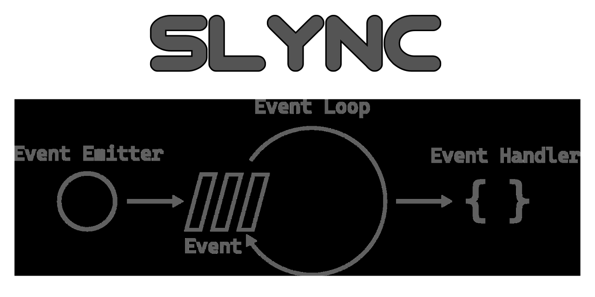

<div align="center">

# [](https://github.com/nktnet1/slync)

[](https://github.com/nktnet1/slync/actions/workflows/pipeline.yml)
&nbsp;
[](https://codecov.io/gh/nktnet1/slync)
&nbsp;
[](https://codeclimate.com/github/nktnet1/slync/maintainability)
&nbsp;
[](https://snyk.io/test/github/nktnet1/slync)
&nbsp;
[](https://github.com/search?q=repo%3Anktnet1%2Fslync++language%3ATypeScript&type=code)

[](https://www.npmjs.com/package/slync?activeTab=versions)
&nbsp;
[](https://packagephobia.com/result?p=slync)
&nbsp;
[](https://depfu.com/github/nktnet1/slync?project_id=39032)
&nbsp;

[](https://github.com/nktnet1/slync/issues)

[](https://sonarcloud.io/summary/new_code?id=nktnet1_slync)
&nbsp;
[](https://app.codacy.com/gh/nktnet1/slync/dashboard?utm_source=gh&utm_medium=referral&utm_content=&utm_campaign=Badge_grade)
&nbsp;
[](https://app.deepsource.com/gh/nktnet1/slync/)
&nbsp;
[](https://codebeat.co/projects/github-com-nktnet1-slync-main)
&nbsp;
[](https://github.com/nktnet1/slync/stargazers)

[](https://moiva.io/?npm=slync)
&nbsp;
[](https://moiva.io/?npm=slync)
&nbsp;
[](https://moiva.io/?npm=slync)
&nbsp;
[](https://moiva.io/?npm=slync)
&nbsp;
[](https://moiva.io/?npm=slync) 

---

0 dependencies event-loop blocking synchronous sleep

sleep + sync = slync

modelled after [atomic-sleep](https://github.com/davidmarkclements/atomic-sleep)

[](https://replit.com/@nktnet1/slync-example#index.js)

</div>

---

- [1. Installation](#1-installation)
- [2. Usage](#2-usage)
- [3. License](#3-license)
- [4. Limitations](#4-limitations)
- [5. Caveats](#5-caveats)

## 1. Installation

```
npm install slync
```

## 2. Usage

Try with [Replit](https://replit.com/@nktnet1/slync-example#index.js).

```javascript
slync(ms) // where ms is the number of milliseconds
```

Example usage of synchronously sleeping for 2 seconds:
```javascript
// import slync from 'slync';
const slync = require('slync');

console.log(`0. Current time: ${new Date()}`);

setTimeout(() => {
  console.log(`2. Prints second because slync blocks: ${new Date()}`);
}, 100);

slync(2000);

console.log(`1. Prints first after 2000 milliseconds: ${new Date()}`);
```


## 3. Limitations

There are currently no known limitations.

## 4. Caveats

**slync** is modelled after [atomic-sleep](https://github.com/davidmarkclements/atomic-sleep), with some minor differences:
- **slync** is written in [TypeScript](https://www.typescriptlang.org)
- **slync** only accepts 'number' for the ms parameter whereas [atomic-sleep](https://github.com/davidmarkclements/atomic-sleep) also accepts 'bigint'
- **slync** will determine which sleep method to use (atomic vs naive) at runtime

For synchronous non-blocking sleep, look into [deasync](https://github.com/abbr/deasync).
